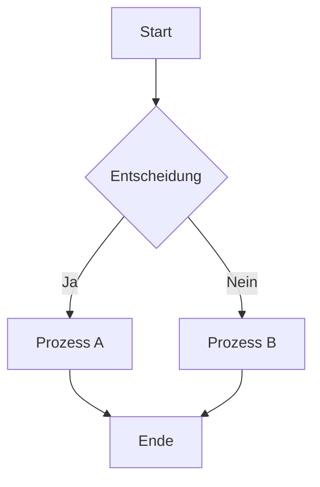

# {{title}}

> **Abstract:** Kurze Zusammenfassung des Artikels in 2-3 Sätzen.

## 📝 Inhaltsübersicht

- [Einführung](#einführung)
- [Hauptteil](#hauptteil)
- [Fazit](#fazit)
- [Referenzen](#referenzen)

## Einführung

### Problemstellung


### Zielsetzung


### Abgrenzung


## Hauptteil

### Kapitel 1

#### Unterkapitel 1.1


#### Unterkapitel 1.2


### Kapitel 2

#### Beispiele & Code

```python
# Beispiel-Code
def example_function():
    return "Hello World"
```

#### Visualisierungen



### Kapitel 3

> [!note] Wichtiger Hinweis
> Hier steht ein wichtiger Hinweis für den Leser.

> [!tip] Tipp
> Ein hilfreicher Tipp für die praktische Umsetzung.

> [!warning] Achtung
> Eine Warnung vor möglichen Fallstricken.

## Praxisbeispiel

### Schritt-für-Schritt Anleitung

1. **Schritt 1:** Beschreibung
   ```bash
   # Terminal-Befehl
   echo "Beispiel"
   ```

2. **Schritt 2:** Beschreibung
   - Unterpunkt A
   - Unterpunkt B

3. **Schritt 3:** Beschreibung

## Fazit

### Zusammenfassung


### Erkenntnisse

- Erkenntnis 1
- Erkenntnis 2
- Erkenntnis 3

### Ausblick


## Weiterführende Informationen

### Verwandte Artikel

- [[Notes/verwandter-artikel]]
- [[Projects/verwandtes-projekt/README]]

### Externe Ressourcen

- [Link 1](https://example.com) - Beschreibung
- [Link 2](https://example.com) - Beschreibung

## Referenzen

[1] Autor, Titel, Jahr, URL  
[2] Autor, Titel, Jahr, URL  
[3] Autor, Titel, Jahr, URL  

---

**Metadaten:**
- **Erstellt:** {{date:YYYY-MM-DD}}
- **Letzte Änderung:** {{date:YYYY-MM-DD}}
- **Status:** Draft
- **Kategorie:** 
- **Lesezeit:** ~X Minuten