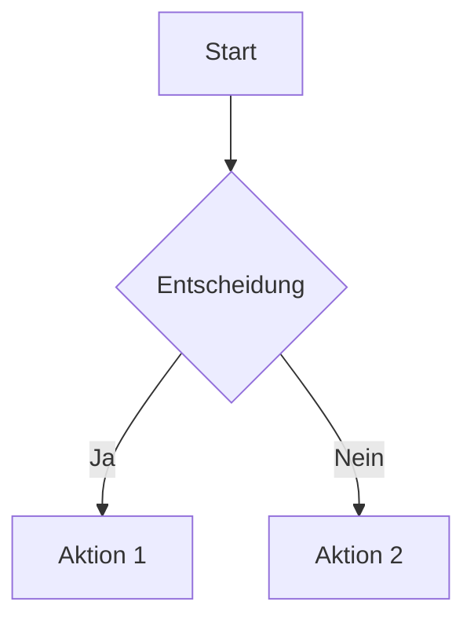

# Willkommen im Obsidian Vault

Dieses ist ein adaptiv erweiterbares Obsidian Vault, das automatisch als Website veröffentlicht wird.

## Struktur

Das Vault ist in folgende Bereiche organisiert:

- **[[Notes/README|Notes]]** - Hauptbereich für Notizen und Artikel
- **[[Templates/README|Templates]]** - Vorlagen für neue Notizen
- **[[Attachments/README|Attachments]]** - Medien und Dateien
- **[[Projects/README|Projects]]** - Projektbezogene Dokumentation

## Features

### Automatische Veröffentlichung
Jeder Push auf das Repository löst eine automatische Konvertierung und Veröffentlichung über GitHub Pages aus.

### Unterstützte Obsidian-Features
- **Wikilinks**: [[Notes/Beispiel-Notiz]]
- **Tags**: #beispiel #vault #obsidian
- **Backlinks**: Automatische Verknüpfungen zwischen Notizen
- **Graph-Ansicht**: Visualisierung der Notiz-Verbindungen
- **LaTeX-Math**: $E = mc^2$
- **Mermaid-Diagramme**:

### Callouts
> [!note] Hinweis
> Dies ist ein Beispiel für ein Callout-Element.

> [!tip] Tipp
> Verwende aussagekräftige Dateinamen und Tags für bessere Organisation.

## Erste Schritte

1. Clone das Repository lokal
2. Öffne den `vault/` Ordner in Obsidian
3. Erstelle neue Notizen und organisiere sie in den Unterordnern
4. Committe und pushe deine Änderungen
5. Die Website wird automatisch unter GitHub Pages aktualisiert

## Erweiterung

Das Vault kann leicht erweitert werden:

- Füge neue Ordner-Strukturen hinzu
- Erstelle eigene Templates
- Nutze Obsidian-Plugins (für lokale Nutzung)
- Passe die GitHub Actions Workflow an

---

*Letzte Aktualisierung: {{date:YYYY-MM-DD}}*